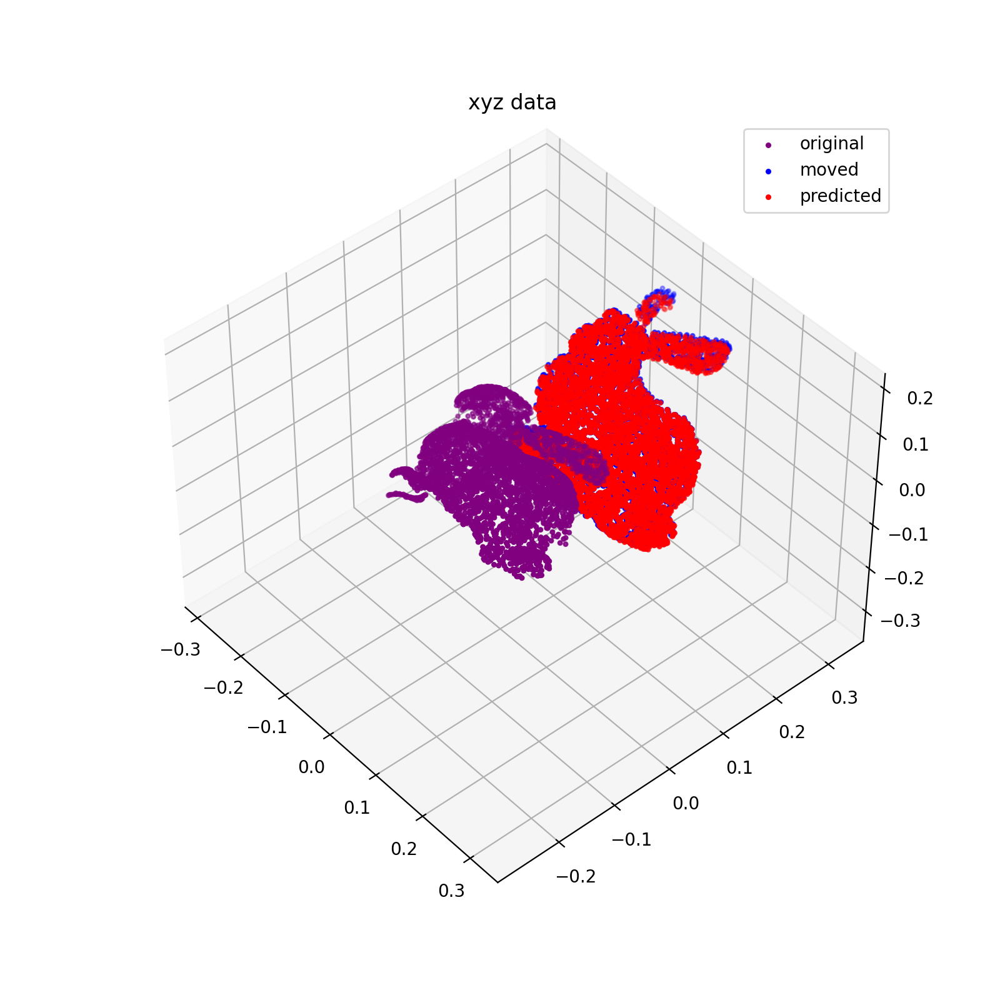

# リー代数と回転、並進の最適化

## * 参考文献

本資料は以下を参考にして理解や計算を行った。適宜参考資料を見ると分かりやすい。特にリー代数の世界のイメージ。

[CV・CG・ロボティクスのためのリー群・リー代数入門][リー代数のブログ] (シリーズになっているブログ)
[slambook-en][slambook] (Visual SLAM 本の __Lie Group and Lie Algebra__)
[3次元回転 (金谷健一)][3次元回転] (第6章)

[リー代数のブログ]:https://swkagami.hatenablog.com/entry/lie_00toc
[slambook]:https://github.com/gaoxiang12/slambook-en
[3次元回転]:https://www.kyoritsu-pub.co.jp/book/b10003189.html

## * はじめに : 目標と結果

ある3次元上の点群($p_i$ i=0~N-1)が回転と並進を用いて $z_i$ に移動されるとする。
このときの回転行列, 並進ベクトルをリー代数を使って求めたい。最適化される関数は変換行列 T (transformation matrix) を用いると以下となる。

$$
\begin{align}
E(T) &= \frac{1}{2} \sum_i \|z_i - Tp_i \|^2 \\
   T &= \begin{pmatrix} R & t \\ 0^T & 1 \end{pmatrix}
\end{align}
$$

このとき, 点群 $p_i$, $z_i$ はそれぞれ同次座標とする。(4次元のベクトルであり、4つ目の成分が常に 1)
この変換行列 T を変数に持つ関数 $E(T)$ を最小にする $T^{*}$ を求める。

point cloud でよく出てくるウサギを使い、適当な回転と並進を与え、それを求めた結果が以下である。(紫の点群は $p_i$, 青の点群が $z_i$, 赤の点群が求めた $T$ を使い $p_i$ を変換したものである)

## * 概要

### 目的

上で述べたように、2つの点群間の変換行列 $T$ を二乗誤差の最適化することにより求める。
このとき、リー代数を使うことで二乗誤差の微分が簡単に求まることを理解する。

### 回転行列の世界は曲がった空間

回転の場合, 9次元空間の中の3次元(3自由度)の曲がったもの。この曲がった世界で回転行列が表現される。
イメージするなら, 3次元空間の中のぐにゃぐにゃした2次元のもの(球面や魔法の絨毯)が回転行列のパラメータを表す。

### 回転行列 $R$ や変換行列 $T$ の微分は難しい

3次元の回転行列、変換行列はそれぞれ 9, 12 個の定まっていない値を持つ。
並進移動のみであれば 3次元 3自由度のパラメータであるため微分は簡単に行えるが、回転が加わると微分が困難になる。

回転行列は 9個のパラメータ(3x3行列)を持つが、オイラー角や roll・pitch・yaw で表せるように 3自由度である。
これは回転行列が直交行列であり、行列式が 1 になる拘束条件によるためである。
仮に回転行列の 9個の各成分で微分が求まり、それを元に勾配法を使ったとしても、拘束条件を満たしながら次の値に変化させるのは難しい。

### リー代数上の回転行列、変換行列は 3, 6 次元で表現できる

回転行列と変換行列は群であり、さらにリー群の条件を満たす。
さらに、接空間(tangent space, 接線のようなもの)においてリー代数として表現できる。
このリー代数上では、回転行列は 3次元のベクトル、変換行列は 6次元のベクトルとして記述される。

(本資料ではリー群、リー代数の詳細は書かない(書けない))

### リー代数上で二乗誤差の微分が求まる

最小化したい二乗誤差の回転行列、変換行列のリー代数での微分が求まる。
それらは元の回転行列、変換行列を使って表せられる。

### 勾配法で二乗誤差を最小にする回転行列と変換行列が求まる

微分が求まるため、勾配法を使い次々に回転行列と変換行列を更新することで最適解が得られる。
ただし、リー代数が成り立つのは接空間上であるため、更新ごとにリー群(通常の回転行列と変換行列)に戻す必要がある。

## * 目次

1. はじめに使う数式や記号の定義を行う
2. 目標は3次元回転と並進を求めることだが、まずは回転のみの場合(SO(3))で考える
3. 回転に並進移動を加えて考える (SE(3))
4. おまけとして、2次元回転 (SO(2)) を考える
5. 同様に2次元回転と並進 (SE(2)) を考える

## * 使う数式の定義

以下のような数式の定義を行う。

### 1. ベクトルの内積

$$
\begin{align*}
    <a, b> &= a^T b \\
    \|a-b\|^2 &= (a-b)^T (a-b) = <a-b, a-b>
\end{align*}
$$

### 2. ベクトルの反対称行列化とその逆

3次元のベクトル $\bm{a} = (a, b, c)^T$ に対して反対称行列化を $\wedge$ 記号で定義する。

$$
    \bm{a}^{\wedge} = \begin{pmatrix} 0 & -c & b \\ c & 0 & -a \\ -b & a & 0 \end{pmatrix}
$$

反対称行列をベクトル化する記号を $\vee$ で定義する。

$$
    \begin{pmatrix} 0 & -c & b \\ c & 0 & -a \\ -b & a & 0 \end{pmatrix}^{\vee} = \begin{pmatrix} a \\ b \\ c \end{pmatrix}
$$

### 3. 反対称行列とベクトルの外積

反対称行列とベクトルの積は、反対称行列をベクトル化したものとの外積に等しい。

$$
    \bm{a}^{\wedge} \bm{b} = \bm{a} \times \bm{b}
$$

これより次が成り立つのは明らかである。

$$
    \bm{a}^{\wedge} \bm{b} = - \bm{b}^{\wedge} \bm{a}
$$

### 4. 同次座標

変換行列を使う際は 3次元のベクトルを同次座標で書いている。

$$
    \begin{pmatrix} x \\ y \\ z \\ 1 \end{pmatrix}
$$

また、回転行列を使う際は通常の 3次元のベクトルとして書いている。
特に断りなく記述しているが、$Rp$, $Tp$ など表記で分かるためである。

### 5. 6次元ベクトルの $\wedge$ 記号

2つの 3次元ベクトル ($\phi, \rho$) をつなげて 6次元ベクトル ($\xi$) にする。それに $\wedge$ をつけたものを以下に定義する。これは 4x4 の行列になる。
ただし、3次元ベクトルに $\wedge$ つけたものは反対称行列化したものである。

$$
\begin{align*}
    \xi &= \begin{pmatrix} \phi \\ \rho \end{pmatrix} \\
    \xi^{\wedge} &= \begin{pmatrix} \phi^{\wedge} & \rho \\ 0^T & 0 \end{pmatrix}
\end{align*}
$$

### 6. ベクトルの正規化記号 $\mathcal{N}$

ベクトルを正規化する記号 $\mathcal{N}$ を導入する。

$$
\begin{align*}
    N\left\lbrack\begin{pmatrix} a \\ b \\ c \end{pmatrix} \right\rbrack = \frac{1}{\sqrt{a^2+b^2+c^2}} \begin{pmatrix} a \\ b \\ c \end{pmatrix}
\end{align*}
$$

## * 3次元回転 (SO(3)) のリー代数

以下の流れで説明する。
1. 微小な回転角では回転行列が反対称行列で表現できることを示す
2. 回転行列が指数関数として表せることを示す
3. 代数による表現
4. 指数関数を回転ベクトルで記述する
5. 目的関数 $E(R)$ の 回転行列 $R$ に関する微分を求める
6. 勾配法のアルゴリズム

### 1. 回転行列 R の微小回転と反対称行列

本節のまとめ
- 微小回転を行う回転行列を求め、それがどのような行列か知る
- この行列がベクトルでどういう意味が知る

ある軸周りで微小角度 $\Delta\theta$ だけ回転させる回転行列をテイラー展開すると以下になる。

$$
    R = I + A\Delta\theta + \mathcal{O}(\Delta\theta^2)
$$

回転行列は直交行列なので以下が成り立つ。ただし、$\Delta\theta$ の二次以上の項を無視する。

$$
\begin{align*}
    RR^T &= (I + A\Delta\theta + \mathcal{O}(\Delta\theta^2))(I + A\Delta\theta + \mathcal{O}(\Delta\theta^2))^T \\
         &= I + (A + A^T)\Delta\theta + \mathcal{O}(\Delta\theta^2) \\
         &= I \\
    A^T  &= -A
\end{align*}
$$

行列 A は反対称行列 (skew symmetric matrix) である。
であるから、A を次のように書ける。また新たにベクトル $l$ を定義する。

$$
\begin{align*}
    A &= \begin{pmatrix} 0 & -l_3 & l_2 \\ l_3 & 0 & -l_1 \\ -l_2 & l_1 & 0 \end{pmatrix} \\
    l &= \begin{pmatrix} l_1 \\ l_2 \\ l_3 \end{pmatrix}
\end{align*}
$$

ベクトル $a$ を微小回転により $a'$ に移動させたとすると、以下のように書ける。

$$
\begin{align*}
    a' &= (I + A\Delta\theta) a \\
       &= a + \Delta\theta A a \\
       &= a + \Delta\theta l \times a
\end{align*}
$$

これは、ベクトル $\Delta\theta l$ (大きさを含めるため $\Delta\theta$ を入れた) は回転ベクトルであることを意味している。(ベクトル $l$ を軸にベクトル $a$ を回転させる)

### 2. 回転行列を指数関数で表現する

本節のまとめ。
- 回転行列を回転角で微分する
- 回転行列を指数関数で表現する

回転軸 $l$ (大きさ1のベクトル) の周りを回転させる回転行列 $R(\theta)$ を考える。この回転軸を中心に微小角度 $\Delta\theta$ だけ回転させる。
この時の回転行列 ($R(\theta + \Delta\theta)$) と元の回転行列を差を微小量 $\Delta\theta $ で割り、0に近づけるとそれは微分になる。

$$
\begin{align*}
    \frac{dR}{d\theta} &= \lim_{\Delta\theta \rightarrow 0} \frac{R(\theta + \Delta\theta) - R(\theta)}{\Delta\theta} \\
        &= \lim_{\Delta\theta \rightarrow 0} \frac{R(\Delta\theta) R(\theta) - R(\theta)}{\Delta\theta} \\
        &= \lim_{\Delta\theta \rightarrow 0} \frac{R(\Delta\theta) - I}        {\Delta\theta} R(\theta) \\
        &= \lim_{\Delta\theta \rightarrow 0} \frac{I + A\Delta\theta - I}{\Delta\theta} R(\theta) \\
        &= A R(\theta)
\end{align*}
$$

回転行列の微分は元の回転行列に行列 A をかけたものになる。微分を続けると以下になる。

$$
    \frac{d^n R}{d\theta^n} = A^n R
$$

回転行列 R を回転角 $\theta = 0$ を周りでテイラー展開すると以下になる。

$$
\begin{align*}
    R(\theta) &= I + \frac{dR}{d\theta}\theta + \frac{1}{2!}\frac{d^2R}{d\theta^2}\theta^2 + \cdots + \frac{1}{n!}\frac{d^n R}{d\theta^n} + \cdots \\
        &= I + \theta A + \frac{\theta^2}{2!}A^2 + \cdots + \frac{\theta^n}{n!}A^n + \cdots \\
        &= e^{A\theta}
\end{align*}
$$

最後の変形は、指数関数の定義の変数を行列に置き換えたものである。

$$
    e^x = \sum_{n=0}^{\infty} \frac{x^n}{n!}
$$

### 3. 代数による表現

本節のまとめ。
- 指数関数の肩(中身)を3次元空間のように表現する
- この中身を一般的な表現をする

上記結果の指数の肩に注目する。行列 A は 9個の成分があるが、中身は $l_1, l_2, l_3$ (と 0 ) の3種類である。
次のように $A\theta$ を表現してみる。

$$
\begin{align*}
    A\theta &= \Omega_1 \begin{pmatrix} 0 & 0 & 0 \\ 0 & 0 & -1 \\ 0 & 1 & 0 \end{pmatrix} + \Omega_2 \begin{pmatrix} 0 & 0 & 1 \\ 0 & 0 & 0 \\ -1 & 0 & 0 \end{pmatrix} + \Omega_3 \begin{pmatrix} 0 & -1 & 0 \\ 1 & 0 & 0 \\ 0 & 0 & 0 \end{pmatrix} \\
        &= \Omega_1 A_1 + \Omega_2 A_2 + \Omega_3 A_3
\end{align*}
$$

次のような積を導入する。
$$
    [A, B] = AB - BA
$$

これを $A_1, A_2, A_3$ に当てはめると以下になる。

$$
    [A_1, A_2] = A_3, \ [A_2, A_3] = A_1, \ [A_3, A_1] = A_2
$$

以下のような通常の3次元空間で考えると、この $A_1, A_2, A_3$ は基本ベクトルのようなものであり、$A\theta = \Omega_1 A_1 + \Omega_2 A_2 + \Omega_3 A_3$ は線型空間(ベクトル空間)である。
さらに、積を導入しているため代数系と呼ばれる。(これは怪しい表現)

$$
\begin{align*}
    \bm{x} &= x_1 \bm{e}_1 + x_2 \bm{e}_2 + x_3 \bm{e}_3 \\
    \bm{e}_3 &= \bm{e}_1 \times \bm{e}_2 \\
    \bm{e}_1 &= \bm{e}_2 \times \bm{e}_3 \\
    \bm{e}_2 &= \bm{e}_3 \times \bm{e}_1 \\
\end{align*}
$$

一般的に $A\theta$ を表現したい。
$A\theta$ は反対称行列であるため、3次元のベクトル $\phi = (\phi_1, \phi_2, \phi_3)^T$ で書ける。($A\theta = \phi^{\wedge}$)
このときの回転角と単位回転ベクトルは以下になる。

$$
\begin{align*}
    l &= \mathcal{N}\left\lbrack\phi\right\rbrack \\
    \theta &= \| \phi \|
\end{align*}
$$

すなわち $\phi = \theta l$ とも書ける。

### 4. 指数関数を回転ベクトルで記述する

本節のまとめ。
- 指数関数による表現を計算し、回転角と単位回転ベクトルで表す

今までの話を合わせると、回転行列は指数関数で記述でき、その肩は回転ベクトル $\phi$ (を反対称行列にしたもの) である。

$$
\begin{align*}
    R &= \exp \left(\phi^{\wedge} \right) \\
        &= \sum_{n=0}^{\infty}\frac{(\phi^{\wedge})^n}{n!}
\end{align*}
$$

無限の項を計算するのは不可能であるが、単位回転ベクトルの n 乗を計算することで、簡単な式に展開できる。
はじめに結果を書く。(長いので途中計算は無視して問題ない)

$$
    \exp \left(\phi^{\wedge}\right) = \cos\theta I + (1 - \cos \theta) l.l^T + \sin \theta l^{\wedge}
$$

計算に使う準備として単位回転ベクトル $l$ の $(l^{\wedge})^n$ を求める。

$$
\begin{align*}
    (l^{\wedge})^2 &= l^{\wedge} l^{\wedge} \\
        &= l.l^T - I \\
    (l^{\wedge})^3 &= l^{\wedge} l^{\wedge} l^{\wedge} \\
        &= -l^{\wedge}
\end{align*}
$$

$(l^{\wedge})^3$ は $(l^{\wedge})$ がベクトルの外積 ($l \times$) と同じ計算あることを考えれば、簡単に求まる。
4次以降の計算は上の式を使えば明らかであり、次のようにまとめられる。

$$
\begin{align*}
    (l^{\wedge})^{2n+1} &= (-1)^n l^{\wedge} \\
    (l^{\wedge})^{2n} &= (-1)^{n+1} (l.l^T - I)
\end{align*}
$$

これらを指数関数の $\sum$ に当てはめる。

$$
\begin{align*}
    \exp \left(\phi^{\wedge}\right) &= \sum_{n=0}^{\infty}\frac{(\phi^{\wedge})^n}{n!} \\
        &= \sum_{n=0}^{\infty}\frac{(\theta l^{\wedge})^n}{n!} \\
        &= I + \theta l^{\wedge} + \frac{\theta^2}{2!} (l^{\wedge})^2 + \frac{\theta^3}{3!} (l^{\wedge})^3 + \frac{\theta^4}{4!} (l^{\wedge})^4 + \cdots \\
        &= (l.l^T - (l^{\wedge})^2) + \theta l^{\wedge} + \frac{\theta^2}{2!} (l^{\wedge})^2 - \frac{\theta^3}{3!} (l^{\wedge}) + \frac{\theta^4}{4!} (l^{\wedge})^2 + \cdots \\
        &= l.l^T + \left( \theta - \frac{\theta^3}{3!} + \frac{\theta^5}{5!} + \cdots \right) l^{\wedge} - \left( 1 -  \frac{\theta^2}{2!} +  \frac{\theta^4}{4!} \right) (l^{\wedge})^2 \\
        &= l.l^T + \left( \theta - \frac{\theta^3}{3!} + \frac{\theta^5}{5!} + \cdots \right)l^{\wedge}  - \left( 1 -  \frac{\theta^2}{2!} +  \frac{\theta^4}{4!} \right) (l.l^T - I) \\
        &= \cos\theta I + (1 - \cos \theta) l.l^T + \sin \theta l^{\wedge}
\end{align*}
$$

これで回転ベクトルから回転行列が求まった。これ(を展開したもの)はロドリゲスの式とも呼ばれる。

次に、ある回転行列から回転ベクトルの回転角 $\theta$ と単位回転ベクトル $l$ を求めるが、長くなるため、Appendix に導出を書いた。
結果だけ書くと、次になる。

$$
\begin{align*}
    R &= \begin{pmatrix} r_{11} & r_{12} & r_{13}\\
        r_{21} & r_{22} & r_{23}\\
        r_{31} & r_{32} & r_{33} \end{pmatrix} \\
    \theta &= \arccos \left(\frac{\text{tr}(R) - 1}{2} \right) \\
    l &= - \mathcal{N}\left\lbrack \begin{pmatrix} r_{23} - r_{32}\\ r_{31} - r_{13}\\ r_{12} - r_{21} \end{pmatrix} \right\rbrack
\end{align*}
$$

### 5. 目的関数 $E$ の 回転行列 $R$ に関する微分を求める

本節のまとめ。
- 回転ベクトル $\phi$ を変数に持つ目的関数 $E(\phi)$ を微小変化させて微分を求める

方針
- 回転ベクトルに対する微分を直接求めることが難しい
- 微小変化させた目的関数 $E(\phi + \Delta\phi)$ を求める
- $E(\phi + \Delta\phi) = E(\phi) + (\Delta E)^T \Delta \phi$ から微分を定義する

目的関数 $E(R)$ は回転ベクトル $\phi$ を使うと次のように書ける。

$$
\begin{align*}
    E(R) &= \frac{1}{2} \sum_{i=0}^{N-1} \left<z_i - Rp_i, z_i - Rp_i \right> \\
    E(\phi) &= \frac{1}{2} \sum_{i=0}^{N-1} \left<z_i - e^{\phi^{\wedge}}p_i, z_i - e^{\phi^{\wedge}}p_i \right>
\end{align*}
$$

微小変化させると以下になる。

$$
\begin{align*}
    E(\phi + \Delta\phi) &= \frac{1}{2} \sum_{i=0}^{N-1} \left<z_i - e^{\Delta\phi^{\wedge}} e^{\phi^{\wedge}} p_i, z_i - e^{\Delta\phi^{\wedge}} e^{\phi^{\wedge}} p_i \right> \\
        &= \frac{1}{2} \sum \left<z_i - (I + \Delta\phi^{\wedge}) e^{\phi^{\wedge}} p_i, \dots\right> \\
        &= \frac{1}{2} \sum \left<\left(z_i - e^{\phi^{\wedge}}p_i \right) - \Delta\phi^{\wedge} e^{\phi^{\wedge}}p_i, \dots \right> \\
        &= \frac{1}{2} \sum \left<z_i - Rp_i, \dots \right> - \left<\Delta\phi^{\wedge} Rp_i, z_i - Rp_i  \right> - \left<z_i - Rp_i, \Delta\phi^{\wedge} \right> + \left< \Delta\phi^{\wedge} R p_i, \dots \right> \\
        &= E(\phi) - \sum \left< \Delta\phi^{\wedge} Rp_i, z_i - Rp_i\right> + \mathcal{O}(\Delta\phi^2)
\end{align*}
$$

目的関数の微小変化量は以下になる。

$$
\begin{align*}
    \Delta E &= E(\phi + \Delta\phi) - E(\phi) \\
        &= - \sum \left< \Delta\phi^{\wedge} Rp_i, z_i - Rp_i\right> \\
        &= - \sum \left< \Delta\phi \times Rp_i, z_i - Rp_i\right> \\
        &= - \sum \left< \Delta\phi, Rp_i \times \left( z_i - Rp_i \right)\right> \ \ \left(<a\times b, c> = <a, b\times c> \right) \\
        &= - \sum \left< \Delta\phi, Rp_i \times z_i \right> \ \ \left(a \times a = 0 \right)　\\
        &= \left< \Delta\phi, - \sum Rp_i \times z_i \right> \ \ \left(a \times a = 0 \right)
\end{align*}
$$

これより、目的関数の回転ベクトル $\phi$ に対する微分は以下となる。

$$
    \nabla E = - \sum Rp_i \times z_i
$$

### 6. 勾配法のアルゴリズム

本節のまとめ。
- リー代数を使用した目的関数の微分を使い、勾配法で最小化する回転行列を求める

一般的な勾配法のアルゴリズムは以下である。
ただし、目的関数 $E$ と変数 $x$ を用いる。

1. 変数 $x$ の初期値 $x_0$ を与える
2. $x_0$ での目的関数の微分 $\left.\frac{\text{dE}}{\text{dx}}\right|_{x_0}$ を求める
3. 学習率 $\alpha$ を使い、変数を更新する。 $x_1 = x_0 - \alpha \left.\frac{\text{dE}}{\text{dx}}\right|_{x_0}$
4. 収束するまで (更新回数や変位量が小さくなるまで)、2, 3 を繰り返す
5. このときの $x$ を最適解 $x^{*}$ とする

回転行列を求める勾配法のアルゴリズムは以下となる。

1. 回転ベクトルの初期値を与える ($\theta_0, l_0$)
2. 回転行列を求める
3. リー代数での回転ベクトル $\phi_0$ を求める ($\phi = \theta l$)
4. 現在の目的関数の微分 $\left.\frac{\text{dE}}{\text{d}\phi}\right|_{\phi_0}$ を求める
5. 学習率 $\alpha$ を使い、$\phi$ を更新する。($\phi_1 = \phi_0 - \alpha \left.\frac{\text{dE}}{\text{d}\phi}\right|_{\phi_0}$)
6. 収束するまで (更新回数や変位量が小さくなるまで)、2, 3, 4, 5 を繰り返す
7. このときの $\phi$ が最適解 $\phi^{*}$ であり、回転行列 $R(\phi^{*})$, 回転ベクトル $\theta^{*} l^{*}$ も求まる

上記 2. でそのときの回転行列を求めている。この回転行列でのリー代数(接空間)を知りたいためである。

学習率 $\alpha$ を使いたくない場合はヘッセ行列 (Hessian) を求めればよいが、本資料ではそこまでは立ち入らない。
回転行列のヘッセ行列は [3次元回転] が参考になるかもしれない。

## * 3次元回転, 並進 (SE(3) のリー代数

以下の流れで説明する。
1. 微小な回転角と並進移動では変換行列が指数関数として表せることを示す
2. 指数関数をリー代数のベクトルで表現する
3. 目的関数 $E(T)$ の変換行列 $T$ に関する微分を求める
4. 勾配法のアルゴリズム

### 1. 微小変位の変換行列と指数関数

本節のまとめ。
- 変換行列を微小変位させたとき、回転行列と同様に $I + B$ の形で求まる
- 変換行列が指数関数として定義される

ある変換行列 $T$ を微小変化させたとき、変換行列がどのような式になるかを考える。
変換行列を以下とし、微小変化させる回転ベクトルを $\Delta\phi$, 並進移動量を $\Delta\rho$ とする。
このとき新たな変換行列は、次の回転行列と並進移動量になる。

$$
\begin{align*}
    R_\text{new} &= (I + \Delta\phi^{\wedge}) R \\
    t_\text{new} &= t + \Delta\phi \times t + \Delta\rho \\
        &= (I + \Delta\phi^{\wedge}) t + \Delta\rho
\end{align*}
$$

$R_\text{new}$ は今までの議論で明らかである。
$t_\text{new}$ の 1, 3 項目は元の並進移動と新たな並進移動である。2項目は元の並進移動が新たな回転ベクトルにより変位した値である。
これより、新たな変換行列 $T_\text{new} = \Delta T.T$ は下式のように表現される。

$$
\begin{align*}
    \Delta T.T &= \begin{pmatrix} (I + \Delta\phi^{\wedge}) R &  (I + \Delta\phi^{\wedge}) t + \Delta\rho \\ 0^T & 1\end{pmatrix} \\
        &= T + \begin{pmatrix} \Delta\phi^{\wedge} R & \Delta\phi^{\wedge} t + \Delta\rho \\ 0^T & 0 \end{pmatrix} \\
        &= T +  \begin{pmatrix} \Delta\phi^{\wedge} & \Delta\rho \\ 0^T & 0 \end{pmatrix} \begin{pmatrix} R & t \\ 0^T & 1 \end{pmatrix} \\
        &= \left( I + \begin{pmatrix} \Delta\phi^{\wedge} & \Delta\rho \\ 0^T & 0 \end{pmatrix} \right) T \\
        &= \left( I + \Delta\xi^{\wedge} \right) T
\end{align*}
$$

回転行列のときと同様に変換行列は指数関数で表現できる。

$$
\begin{align*}
    T &= e^{\xi^{\wedge}} \\
    \xi^{\wedge} &= \begin{pmatrix} \phi^{\wedge} & \rho \\ 0^T & 0 \end{pmatrix}
\end{align*}
$$

### 2. 指数関数をリー代数のベクトルで表現する

本節のまとめ。
- 指数関数を展開し、簡単なベクトルと行列で表現する

以降では、変換行列を示す指数関数 $e^{\xi^{\wedge}}$ が以下になることを示す。
(次式は本節の結果である)

$$
\begin{align*}
    e^{\xi^{\wedge}} &= \begin{pmatrix} \sum_{n=0}^{\infty}\frac{1}{n!} (\phi^{\wedge})^n & \sum_{n=0}^{\infty}\frac{1}{(n+1)!} (\phi^{\wedge})^n \rho \\ 0^T & 1\end{pmatrix} \\
        &= \begin{pmatrix} R & J\rho \\ 0^T & 1 \end{pmatrix} \\
    J &= \frac{\sin\theta}{\theta} I + (1 - \frac{\sin\theta}{\theta})l.l^T + \frac{1 - \cos\theta}{\theta} l^{\wedge} \\
    J^{-1} &= \frac{\theta / 2}{\tan \frac{\theta}{2}} I + \left(1 - \frac{\theta / 2}{\tan \frac{\theta}{2}} \right)l.l^T - \frac{\theta}{2}l^{\wedge}
\end{align*}
$$

指数関数の展開には $(\xi^{\wedge})^n$ の計算が必要になる。
はじめにこれを求める。

$$
\begin{align*}
    \xi^{\wedge} &= \begin{pmatrix} \phi^{\wedge} & \rho \\ 0^T & 0 \end{pmatrix} \\
    (\xi^{\wedge})^2 &= \begin{pmatrix} \phi^{\wedge} \phi^{\wedge} & \phi^{\wedge} \rho \\ 0^T & 0 \end{pmatrix} \\
    (\xi^{\wedge})^3 &= \begin{pmatrix} \phi^{\wedge} \phi^{\wedge} \phi^{\wedge} & \phi^{\wedge} \phi^{\wedge} \rho \\ 0^T & 0 \end{pmatrix} \\
    \cdots \\
    (\xi^{\wedge})^n &= \begin{pmatrix} (\phi^{\wedge})^n & (\phi^{\wedge})^{n-1} \rho \\ 0^T & 0 \end{pmatrix}
\end{align*}
$$

これを無限回の和に代入すると以下となる。

$$
\begin{align*}
    T &= I + \begin{pmatrix} \phi^{\wedge} & \rho \\ 0^T & 0 \end{pmatrix}
        + \frac{1}{2!} \begin{pmatrix} (\phi^{\wedge})^2 & (\phi^{\wedge}) \rho \\ 0^T & 0 \end{pmatrix}
        + \cdots
        + \frac{1}{n!} \begin{pmatrix} (\phi^{\wedge})^n & (\phi^{\wedge})^{n-1} \rho \\ 0^T & 0 \end{pmatrix}
        + \cdots \\
        &= \begin{pmatrix} \sum_{n=0}^{\infty}\frac{1}{n!} (\phi^{\wedge})^n & \sum_{n=0}^{\infty}\frac{1}{(n+1)!} (\phi^{\wedge})^n \rho \\ 0^T & 1\end{pmatrix} \\
        &= \begin{pmatrix} R & J\rho \\ 0^T & 1 \end{pmatrix}
\end{align*}
$$

次に $J$ を求める。ただし $\phi = \theta l$ とする (回転量と単位回転ベクトル)。

$$
\begin{align*}
    \sum_{n=0}^{\infty}\frac{(\phi^{\wedge})^n}{(n+1)!} &= I + \frac{\theta}{2!}l^{\wedge} + \frac{\theta^2}{3!}(l^{\wedge})^2 + \frac{\theta^3}{4!}(l^{\wedge})^3 + \frac{\theta^4}{5!}(l^{\wedge})^4 + \cdots \\
        &= I + \frac{1}{\theta}\left(\frac{\theta^2}{2!} - \frac{\theta^4}{4!} + \cdots \right) l^{\wedge} + \frac{1}{\theta}\left(\frac{\theta^3}{3!} - \frac{\theta^5}{5!} + \cdots \right) (l^{\wedge})^2 \\
        &= I + \frac{1}{\theta}(1 - \cos\theta)l^{\wedge} + \frac{\theta - \sin\theta}{\theta}(l.l^T - I) \\
        &= \frac{\sin\theta}{\theta} I + (1 - \frac{\sin\theta}{\theta})l.l^T + \frac{1 - \cos\theta}{\theta} l^{\wedge}
\end{align*}
$$

$J$ の逆行列 $J^{-1}$ は [slambook] をそのまま引用する。

$$
    J^{-1} = \frac{\theta / 2}{\tan \frac{\theta}{2}} I + \left(1 - \frac{\theta / 2}{\tan \frac{\theta}{2}} \right)l.l^T - \frac{\theta}{2}l^{\wedge}
$$

### 3. 目的関数 $E(T)$ の変換行列 $T$ に関する微分を求める

本節のまとめ。
- リー代数の回転ベクトルと並進 $\xi$ を変数に持つ目的関数 $E(\xi)$ を微小変化させて微分を求める

方針
- 変換行列 $T$ に対する微分を直接求めることが難しい
- 微小変化させた目的関数 $E(\xi + \Delta\xi)$ を求める
- $E(\xi + \Delta\xi) = E(\xi) + (\Delta E)^T \Delta \xi$ から微分を定義する

(手順は回転行列(SO(3))の場合と同様)

目的関数 $E(T)$ は回転ベクトル $\xi$ を使うと次のように書ける。

$$
\begin{align*}
    E(T) &= \frac{1}{2} \sum_{i=0}^{N-1} \left<z_i - Tp_i, z_i - Tp_i \right> \\
    E(\xi) &= \frac{1}{2} \sum_{i=0}^{N-1} \left<z_i - e^{\xi^{\wedge}}p_i, z_i - e^{\xi^{\wedge}}p_i \right>
\end{align*}
$$

微小変化させると以下になる。

$$
\begin{align*}
    E(\xi + \Delta\xi) &= \frac{1}{2} \sum_{i=0}^{N-1} \left<z_i - e^{\Delta\xi^{\wedge}} e^{\xi^{\wedge}} p_i, z_i - e^{\Delta\xi^{\wedge}} e^{\xi^{\wedge}} p_i \right> \\
        &= \frac{1}{2} \sum \left<z_i - (I + \Delta\xi^{\wedge}) e^{\xi^{\wedge}} p_i, \dots\right> \\
        &= \frac{1}{2} \sum \left<\left(z_i - e^{\xi^{\wedge}}p_i \right) - \Delta\xi^{\wedge} e^{\xi^{\wedge}}p_i, \dots \right> \\
        &= \frac{1}{2} \sum \left<z_i - Tp_i, \dots \right> - \left<\Delta\xi^{\wedge} Tp_i, z_i - Tp_i  \right> - \left<z_i - Tp_i, \Delta\xi^{\wedge} \right> + \left< \Delta\xi^{\wedge} T p_i, \dots \right> \\
        &= E(\xi) - \sum \left< \Delta\xi^{\wedge} Tp_i, z_i - Tp_i\right> + \mathcal{O}(\Delta\xi^2) \\
        &= E(\xi) + \Delta E(\xi) + \mathcal{O}(\Delta\xi^2)
\end{align*}
$$

$$
\begin{align*}
    \Delta E(\xi) &= - \sum \left< \Delta\xi^{\wedge} Tp_i, z_i - Tp_i\right> \\
        &= - \sum \left< \begin{pmatrix} \Delta\theta^{\wedge} & \Delta q \\ 0^T & 0 \end{pmatrix} \begin{pmatrix} R & t \\ 0^T & 1\end{pmatrix} \begin{pmatrix} p_i \\ 1 \end{pmatrix}, \begin{pmatrix} z_i \\ 1 \end{pmatrix}- \begin{pmatrix} R & t \\ 0^T & 1\end{pmatrix} \begin{pmatrix} p_i \\ 1 \end{pmatrix} \right>
\end{align*}
$$

$\left< X , Y \right>$ の右側 ($Y$) は 2項に分かれているので、それぞれ順に計算する。
第一項。

$$
\begin{align*}
    \Delta E_1 &= - \sum \left< \Delta\xi^{\wedge} Tp_i, z_i\right> \\
        &= - \sum \left< \begin{pmatrix} \Delta\theta^{\wedge} & \Delta q \\ 0^T & 0 \end{pmatrix} \begin{pmatrix} R & t \\ 0^T & 1\end{pmatrix} \begin{pmatrix} p_i \\ 1 \end{pmatrix}, \begin{pmatrix} z_i \\ 1 \end{pmatrix} \right> \\
        &= - \sum \begin{pmatrix} p_i \\ 1 \end{pmatrix}^T \begin{pmatrix} R & t \\ 0^T & 1\end{pmatrix}^T \begin{pmatrix} \Delta\theta^{\wedge} & \Delta q \\ 0^T & 0 \end{pmatrix}^T \begin{pmatrix} z_i \\ 1 \end{pmatrix} \\
        &= - \sum \begin{pmatrix}Rp_i + t\\ 1 \end{pmatrix}^T \begin{pmatrix} - \Delta\theta^{\wedge} z_i \\ \Delta q^T z_i \end{pmatrix} \ \ \ ((a^{\wedge})^T = -a^{\wedge})\\
        &= - \sum \begin{pmatrix}Rp_i + t\\ 1 \end{pmatrix}^T \begin{pmatrix} z_i^{\wedge} \Delta\theta \\ z_i^T \Delta q \end{pmatrix} \\
        &= \sum \begin{pmatrix}Rp_i + t\\ 1 \end{pmatrix}^T \begin{pmatrix} - z_i^{\wedge} & 0_3 \\ 0^T & - z_i^T \end{pmatrix} \begin{pmatrix} \Delta\theta \\ \Delta q \end{pmatrix}
\end{align*}
$$

第二項。

$$
\begin{align*}
    \Delta E_2 &= \sum \left< \Delta\xi^{\wedge} Tp_i, Tp_i\right> \\
        &= \sum \left< \begin{pmatrix} \Delta\theta^{\wedge} & \Delta q \\ 0^T & 0 \end{pmatrix} \begin{pmatrix} R & t \\ 0^T & 1\end{pmatrix} \begin{pmatrix} p_i \\ 1 \end{pmatrix}, \begin{pmatrix} R & t \\ 0^T & 1\end{pmatrix} \begin{pmatrix} p_i \\ 1 \end{pmatrix} \right> \\
        &= \sum \begin{pmatrix} p_i \\ 1 \end{pmatrix}^T \begin{pmatrix} R & t \\ 0^T & 1\end{pmatrix}^T \begin{pmatrix} \Delta\theta^{\wedge} & \Delta q \\ 0^T & 0 \end{pmatrix}^T \begin{pmatrix} R & t \\ 0^T & 1\end{pmatrix} \begin{pmatrix} p_i \\ 1 \end{pmatrix} \\
        &= \sum \begin{pmatrix}Rp_i + t\\ 1 \end{pmatrix}^T \begin{pmatrix} \Delta\theta^{\wedge} & \Delta q \\ 0^T & 0 \end{pmatrix}^T \begin{pmatrix}Rp_i + t\\ 1 \end{pmatrix} \\
        &= \sum \begin{pmatrix}Rp_i + t\\ 1 \end{pmatrix}^T \begin{pmatrix} -\Delta\theta^{\wedge} (Rp_i + t) \\ \Delta q^T (Rp_i + t) \end{pmatrix} \\
        &= \sum \begin{pmatrix}Rp_i + t\\ 1 \end{pmatrix}^T \begin{pmatrix} (Rp_i + t)^{\wedge} \Delta\theta \\ (Rp_i + t)^T \Delta q \end{pmatrix} \\
        &= \sum \begin{pmatrix}Rp_i + t\\ 1 \end{pmatrix}^T \begin{pmatrix} (Rp_i + t)^{\wedge} & 0_3 \\ 0^T & (Rp_i + t)^T \end{pmatrix} \begin{pmatrix} \Delta\theta \\ \Delta q \end{pmatrix}
\end{align*}
$$

合わせると

$$
\begin{align*}
    \Delta E &= \sum \begin{pmatrix}Rp_i + t\\ 1 \end{pmatrix}^T \begin{pmatrix} (Rp_i + t - z_i)^{\wedge} & 0_3 \\ 0^T & (Rp_i + t - z_i)^T \end{pmatrix} \begin{pmatrix} \Delta\theta \\ \Delta q \end{pmatrix} \\
        &= \sum \begin{pmatrix} - (Rp_i + t) \times z_i \\ Rp_i + t - z_i\end{pmatrix} \begin{pmatrix} \Delta\theta \\ \Delta q \end{pmatrix}
\end{align*}
$$

これより、目的関数の $\xi$ に対する微分は以下となる。

$$
    \nabla E = \sum \begin{pmatrix} - (Rp_i + t) \times z_i \\ Rp_i + t - z_i\end{pmatrix}
$$

### 4. 勾配法のアルゴリズム

本節のまとめ。
- リー代数を使用した目的関数の微分を使い、勾配法で最小化する変換行列を求める

変換行列を求める勾配法のアルゴリズムは以下となる。

1. 変換行列の初期値 $T_0$ を与え、リー代数でのベクトルに変換する ($\xi_0$)
2. 変換行列を求める (初回は $T_0$ なので不要)
3. リー代数でのベクトル $\xi$ を求める
4. 現在の目的関数の微分 $\frac{\text{dE}}{\text{d}\xi}$ を求める
5. 学習率 $\alpha$ を使い、$\xi$ を更新する。($\xi ' = \xi - \alpha \frac{\text{dE}}{\text{d}\xi}$)
6. 収束するまで (更新回数や変位量が小さくなるまで)、2, 3, 4, 5 を繰り返す
7. このときの $\xi$ が最適解 $\xi^{*}$ であり、変換行列 $T(\xi^{*})$ が求まる

以上の手順では、「$T \rightarrow \xi$」, 「$\xi \rightarrow T$」 が必要である。

#### $T \rightarrow \xi$

$T = \begin{pmatrix} R & t \\ 0^T & 1\end{pmatrix} = \begin{pmatrix} R & J\rho \\ 0^T & 1\end{pmatrix}$ であるから、回転ベクトル ($\theta l$) と並進ベクトル ($\rho$) はそれぞれ以下になる。

$$
\begin{align*}
    \theta &= \arccos \left( \frac{\text{tr}(R) - 1}{2} \right) \\
    l &= - \mathcal{N}\left\lbrack \begin{pmatrix} r_{23} - r_{32} \\ r_{31} - r_{13} \\ r_{12} - r_{21} \end{pmatrix}\right\rbrack \\
    \rho &= J^{-1} t
\end{align*}
$$

($\theta, l$ の導出は Appendix を参考にすること)

#### $\xi \rightarrow T$

$\xi = \begin{pmatrix} \phi \\ \rho\end{pmatrix}$ より、回転行列 ($R$) と並進ベクトル ($t$) は以下になる。

$$
\begin{align*}
    l &= \mathcal{N}\lbrack \phi \rbrack \\
    \theta &= \sqrt{\phi_1^2 + \phi_2^2 + \phi_3^2} \\
    R &= \cos\theta I + (1 - \cos\theta)l.l^T + \sin\theta l^{\wedge} \\
    J\rho &= \left( \frac{\sin\theta}{\theta} I + (1 - \frac{\sin\theta}{\theta})l.l^T + \frac{1 - \cos\theta}{\theta} l^{\wedge} \right) \rho
\end{align*}
$$

## * おまけ : 2次元回転 (SO(2))

2次元平面での回転に関して、上記でやったことをあてはめると以下を得る。

### 回転行列の指数関数

反対称行列は $A = \begin{pmatrix} 0 & -1 \\ 1 & 0 \end{pmatrix}$ となり、リー代数の3次元ベクトルは 1次元ベクトル $\phi$ となる。
このベクトルの反対称行列化は以下になる。

$$
    \phi^{\wedge} = \begin{pmatrix} 0 & -\theta \\ \theta & 0 \end{pmatrix}
$$

これと、$A^n$ の下記の計算を使うと、以下を得る。
回転行列 $R$ はよく見る形をしていることが分かる。

$$
\begin{align*}
    A^{2n+1} &= (-1)^n A \\
    A^{2n} &= (-1)^n I \\
    e^{\phi^{\wedge}} &= \cos\theta I + \sin\theta A \\
        &= \begin{pmatrix} \cos\theta & -\sin\theta \\ \sin\theta & \cos\theta\end{pmatrix}
\end{align*}
$$

二乗誤差の微分は次節の SE(2) で計算する。(SE(2)で並進を 0 とすれば SO(2) となる)

## * おまけ : 2次元回転と並進 (SE(2))

説明を省くが、以下が成り立つ。
$\rho$ は2次元ベクトル、$\xi$ は3次元ベクトル、$\xi^{\wedge}$ は 3x3 の行列である。

$$
\begin{align*}
    \xi &= \begin{pmatrix} \phi \\ \rho \end{pmatrix} \\
    \xi^{\wedge} &= \begin{pmatrix} \phi^{\wedge} & \rho \\ 0^T & 0\end{pmatrix} \\
    T &= e^{\xi^{\wedge}} \\
        &= \begin{pmatrix} \sum_{n=0}^{\infty}\frac{1}{n!} (\phi^{\wedge})^n & \sum_{n=0}^{\infty}\frac{1}{(n+1)!} (\phi^{\wedge})^n \rho \\ 0^T & 1\end{pmatrix} \\
        &= \begin{pmatrix} R & J\rho \\ 0^T & 1 \end{pmatrix}
\end{align*}
$$

$J$, $J^{-1}$ を求める。

$$
\begin{align*}
    \sum_{n=0}^{\infty}\frac{(\phi^{\wedge})^n}{(n+1)!} &= I + \frac{\theta}{2!}A + \frac{\theta^2}{3!}A^2 + \frac{\theta^3}{4!}A^3 + \frac{\theta^4}{5!}A^4 + \cdots \\
        &= I + \frac{\theta}{2!}A + \frac{\theta^2}{3!} (-I) + \frac{\theta^3}{4!}(-A) + \frac{\theta^4}{5!}I + \cdots \\
        &= I (1 - \frac{\theta^2}{3!} + \frac{\theta^4}{5!} + \cdots) + A (\frac{\theta}{2!} - \frac{\theta^3}{4!} + \frac{\theta^5}{6!}) \\
        &= \frac{\sin\theta}{\theta} I + \frac{1-\cos\theta}{\theta} A \\
        &= \frac{1}{\theta}\begin{pmatrix} \sin\theta & -(1-\cos\theta) \\ 1 - \cos\theta & \sin\theta \end{pmatrix} \\
        &= \frac{\sin\frac{\theta}{2}}{\theta / 2} \begin{pmatrix} \cos\theta / 2 & -\sin \theta / 2 \\ \sin \theta / 2 & \cos\theta / 2 \end{pmatrix}
\end{align*}
$$

$J$ の行列部分は回転角 $\theta / 2$ の回転行列なので、逆行列 $J^{-1}$ は簡単に求まる。

$$
    J^{-1} = \frac{\theta / 2}{\sin\frac{\theta}{2}} \begin{pmatrix} \cos\theta / 2 & \sin \theta / 2 \\ -\sin \theta / 2 & \cos\theta / 2 \end{pmatrix}
$$

二乗誤差の $\xi$ に対する微分の計算は SE(3) の場合とほとんど同じである。
$\xi$ を微小変化ささせたときの二乗誤差の変化量は以下になる (SE(3)と同じ)。

$$
\begin{align*}
    \Delta E(\xi) &= - \sum \left< \Delta\xi^{\wedge} Tp_i, z_i - Tp_i\right> \\
        &= - \sum \left< \begin{pmatrix} \Delta\theta^{\wedge} & \Delta q \\ 0^T & 0 \end{pmatrix} \begin{pmatrix} R & t \\ 0^T & 1\end{pmatrix} \begin{pmatrix} p_i \\ 1 \end{pmatrix}, \begin{pmatrix} z_i \\ 1 \end{pmatrix}- \begin{pmatrix} R & t \\ 0^T & 1\end{pmatrix} \begin{pmatrix} p_i \\ 1 \end{pmatrix} \right>
\end{align*}
$$

$\left< X , Y \right>$ の右側 ($Y$) は 2項に分かれているので、それぞれ順に計算する。
第一項。

$$
\begin{align*}
    \Delta E_1 &= \sum \begin{pmatrix}(Rp_i + t)^T A z_i\\ -z_i \end{pmatrix}^T \begin{pmatrix} \Delta\theta \\ \Delta q \end{pmatrix}
\end{align*}
$$

第二項。

$$
\begin{align*}
    \Delta E_1 &= \sum \begin{pmatrix} -(Rp_i + t)^T A (Rp_i + t)\\ Rp_i + t \end{pmatrix}^T \begin{pmatrix} \Delta\theta \\ \Delta q \end{pmatrix} \\
        &= \sum \begin{pmatrix} 0 \\ Rp_i + t \end{pmatrix}^T \begin{pmatrix} \Delta\theta \\ \Delta q \end{pmatrix}
\end{align*}
$$

合わせると

$$
\begin{align*}
    \Delta E &= \sum \begin{pmatrix}(Rp_i + t)^T A z_i\\ Rp_i + t -z_i \end{pmatrix}^T \begin{pmatrix} \Delta\theta \\ \Delta q \end{pmatrix}
\end{align*}
$$

これより、目的関数の $\xi$ に対する微分は以下となる。

$$
    \nabla E = \sum \begin{pmatrix} (Rp_i + t)^T A z_i \\ Rp_i + t - z_i\end{pmatrix}
$$

微分が分かったので SE(3) と同様に勾配法を使うことで二乗誤差を最適化できる。

## * Appendix

### 回転ベクトル ←→ 回転行列

回転ベクトル $\phi$ はその大きさ $\theta$ と単位ベクトル $l$ で表せられる。

$$
    \phi = \theta l
$$

このとき回転行列は以下になる。

$$
    R = \cos \theta I + (1 - \cos \theta) l.l^T + \sin \theta l^{\wedge}
$$

回転行列が与えられた時に回転ベクトル (回転角 $\theta$ と単位回転ベクトル $l$) を求める。
はじめに回転角を求める。次に単位回転ベクトルを求める。

導出には上の回転行列を使う。ある行列 A の trace を tr(A) とし、これを回転行列に当てはめる。

$$
\begin{align*}
    \text{tr}(R) &= \cos \theta \cdot \text{tr}\left(I \right) + (1 - \cos \theta) \cdot \text{tr}\left( l.l^T\right) + \sin \theta \cdot \text{tr}\left( l^{\wedge} \right) \\
        &= 3 \cos \theta + (1 - \cos \theta) (l_1^2 + l_2^2 + l_3^2) + 0 \\
        &= 1 + 2 \cos \theta
\end{align*}
$$

これより、回転角 $\theta$ は次になる。

$$
    \theta = \arccos \left(\frac{\text{tr}(R) - 1}{2} \right)
$$

次に、単位回転ベクトルを求める。
方針を考えると次になる。

1. 回転ベクトルで記述した回転行列の第一項, 第二項は対称行列であり、第三項は反対称行列 (skew symmetric matrix) である
2. 転置行列との差を計算すると、第一項, 第二項は消え、第三項のみ残る
3. 残った第三項は $l^{\wedge}$ であるため、ベクトルに戻す ${\vee}$ を使う

回転行列を次のように書いておく。

$$
    R = \begin{pmatrix} r_{11} & r_{12} & r_{13}\\
        r_{21} & r_{22} & r_{23}\\
        r_{31} & r_{32} & r_{33} \end{pmatrix}
$$

上の方針を行っていく。

$$
\begin{align*}
    R^T - R &= \cos \theta I^T + (1 - \cos \theta) (l.l^T)^T + \sin \theta (l^{\wedge})^T \\
        &\ \ \ - \left(\cos \theta I + (1 - \cos \theta) l.l^T + \sin \theta l^{\wedge}\right) \\
        &= -2\sin \theta l^{\wedge} \\
    -2\sin \theta l &= \begin{pmatrix} 0 & r_{21} - r_{12} & r_{31} - r_{13} \\ r_{12} - r_{21} & 0 & r_{32} - r_{23} \\ r_{13} - r_{31} & r_{23} - r_{32} & 0\end{pmatrix} ^{\vee} \\
        &= \begin{pmatrix} 0 & -(r_{12} - r_{21}) & r_{31} - r_{13} \\ r_{12} - r_{21} & 0 & -(r_{23} - r_{32}) \\ -(r_{31} - r_{13}) & r_{23} - r_{32} & 0\end{pmatrix} ^{\vee} \\
        &= \begin{pmatrix} r_{23} - r_{32}\\ r_{31} - r_{13}\\ r_{12} - r_{21} \end{pmatrix} \\
    l &= - \mathcal{N}\left\lbrack \begin{pmatrix} r_{23} - r_{32}\\ r_{31} - r_{13}\\ r_{12} - r_{21} \end{pmatrix} \right\rbrack
\end{align*}
$$
